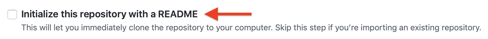

## Project 1

In our first project, you'll get a server up and running, and write and deploy some React-based code using a node.js server. (OMG what does that all mean?)

The goals are:
- Get comfortable with the command line.
- Get experience with Google Cloud Platform.
- Build on knowledge of HTML/CSS.
- Learn basics of the React front-end library.
- Learn how web *browsers* interact with web *servers*.
- Learn how to save data.

### Week 1

This week, we'll spend most of our time getting your server running in the cloud, exploring the command line, and tweaking an existing React app.

#### Getting your (free!) server on Google Cloud Platform.

Sign up for a [Google Cloud Platform account](https://console.cloud.google.com/). You'll need to enter a credit card to prove you're human, but you won't be charged.

Create a new project, then navigate to `Compute Engine` > `VM Instances` and create a new VM. You'll want to use these settings to make sure it's free! Pick your own name, though, obviously. (You may need to create a "project" for this.)


Once you've created your instance, you'll need to open a specific `port` to allow our development server to be publicly accessible on the internet. To do that, navigate to `VPC Network` > `Firewall Rules` and click on `Create Firewall Rule`. Use these settings:


With these done, go back to `Compute Engine` > `VM Instances` and Start your VM instance. Once it's running, you can connect to it with the `SSH` link. It'll open a terminal where you can issue commands.

Run this first command:

`curl -sL https://zamfi.net/img/cp2_setup.sh | bash -`

Copy and paste it from above, don't try to type it in -- it has weird characters like the vertical bar (pipe) `|` in it!

This will take a little while as it installs a bunch of dependencies and creates a new react project for you. While it's installing, take a look at this [list of command line tools](https://files.fosswire.com/2007/08/fwunixref.pdf).

Change into the `hello-world` directory (using `cd hello-world`) and run `npm start`. After a couple of minutes, you should see some "complation succeeded" text with what looks like a URL. That URL won't work -- because you're not on the same local network as your server. Instead, copy the `External IP` from the VM instances page, open up your web browser, and visit *your-ip*`:3000`. For my instance, this was `35.227.190.43:3000` -- you should see a React logo!

You can stop the server by typing control-C (`^C`). Also: use the up/down arrow keys to cycle through previous commands on the command line. Try it: run the server again by pressing the up arrow once and then pressing return.

#### Replacing the generic React starter app

Once you get to this point, open a second terminal window by clicking on `SSH` again. In this terminal, change to the hello-world directory with `cd hello-world` and then use the `nano` program to edit the file `src/App.js`, using the full command `nano src/App.js`. Add some text about yourself! Format it nicely, and show us your new CSS chops by styling through `src/App.css`. Within `nano`, you can save your changes with control-O (`^O` -- that's an "oh", not a "zero") and exit with control-X (`^X`).

Once your'e done, replace the generic React server app with the code from [wishing-well](http://github.com/zamfi/wishing-well), our real starting point for Project 1! Copy the contents of wishing-well's `src/App.js` and `src/App.css` into your project.

#### Extending the wishing well

Make the following changes to the wishing well:

- Add a bunch of new wisdoms.
- Create a “new” button that triggers the `addWisdom` function. There's already CSS for this button in `src/App.css` in a class called `new-wisdom`.
- Ensure a new, different wisdom shows up every time you click. You could guarantee this by cycling from one wisdom to the next. Or by checking to make sure that the new randomly selected wisdom is "different" from the old one.
- Make the wisdom change every 15 seconds on its own, even if you don't click the button. (The [`setInterval`](https://javascript.info/settimeout-setinterval) function might be useful here!)

Challenges (optional):
- Create a new array of attributions, and display a random attribution for each piece of wisdom.
- Make the wisdoms show up cumulatively in a list. Do some research on how to display a list in React. Then don’t show more than 3 at a time!

Finally:
- Make it your own! Reimagine the wishing well on your own in some way. Give it some whimsy, or a new look, or new buttons. Whatever appeals to you!

#### Submitting this part of your homework

First, let's get your server program running permanently. You can create a virtual terminal that runs even after you close your terminal window with the `screen` command. In a terminal window, run `screen`. Then, run your server by switching into the `hello-world` directory (with `cd hello-world`) and running `npm start`.

Then you can leave your screen session running by typing control-A (`^A`) followed by the `D` key (for "disconnect").

Confirm that your server is still running by visiting your-ip`:3000` in your browser.

Then, [email me](mailto:zamfi@cca.edu) that link.

### Week 2

This week, we'll learn how to do development locally (instead of using `nano` on our servers), how to use `git` and GitHub, and how to extend our server functionality to enable some real-time communication. Maybe we'll make a chat app. Who knows!?

#### Creating a repository for your project

There are many ways to share code among computers and people. By far the most common for new projects these days is GitHub. You've used GitHub before to submit homework, but now we're going to extend that work substantially.

First, create a new repository that is **not initialized**:



On creation, you'll see some instructions on how to fill in your repository. Keep this page open, you'll need it later!

Next, connect to your Google Cloud server (using the SSH link as you did last week), and run these commands:

`cd hello-world` -- to get into your hello world directory

`git init` -- to create a new Git repository

`git status` -- to show you which files have been changes / are new to the repository since the last commit. (This should be all the files!)

`git diff` -- to show the contents of each changed file

`git add file1 file2 etc` -- where `file1`, `file2`, `etc` are the files that show up when you run `git status`

`git commit -m 'initial commit'` -- to "commit" your changes to the repository

Next, follow the instructions from GitHub for when you already have an existing repository. Should be something like this:

`git remote add origin <some url>`
`git push -u origin master`

**Congratulations!** When you reload your GitHub repository, you should see your code there. 

#### Creating a local development environment

To allow you to make changes to your code *locally*, meaning on your own computer instead of your server in the Google Cloud, first you'll need to [install `node`](http://nodejs.org) yourself on your computer. You'll also need to [install `git`](https://git-scm.com) if you don't already have it -- I think it's install automatically on Macs and maybe also Windows?

Once you have these, get the "Clone URL" from GitHub for your repository, and clone your repository on your local computer:

`git clone <clone url>`

Then, `cd hello-world` to get into your project folder, and install the "dependencies" -- the libraries required by the server -- using:

`npm install`

And, finally, run your server:

`npm start`

(This last step may fail, reach out to me if so.)

Now you can visit [localhost:3000](http://localhost:3000) in your browser, then edit files like `src/App.js` and `src/App.css` locally and, when you save them, they'll refresh.

#### Starter code for this week

To make sure everyone is on the same page, this week we'll start from a clean slate again. Instead of creating a new project from scratch, we'll take an existing project and clone it directly. Visit [github.com/zamfi/wishing-well](http://github.com/zamfi/wishing-well) and click the big "Fork" button. Then, follow the directions under "Creating a local development environment" above to clone this repository to your computer.

In addition to `npm start`, you'll also need to run a 2nd server program:

`node server/server.js`

This server also requires a new port -- when you run it on your Google Cloud server, you'll need to open port 8080 on your Firewall again, like we did last week.

### Week 2 Homework

This week, make sure that you **fork** the wishing-well starter code into your GitHub account, and then clone it to your computer for local development.

Visit [github.com/zamfi/wishing-well](http://github.com/zamfi/wishing-well) and click the big "Fork" button. Once it's forked, get the "Clone URL" from GitHub for your repository. (There should be a big green 

Clone the repository to your local computer; in a terminal (*not* an SSH terminal to your server), run:

`git clone <clone-url>` -- replace `<clone-url>` with the URL you found on GitHub. Thus, your command should look like `git clone https://github.com/not-a-name/wishing-well` or something similar. (Note the lack of `<` and `>` symbols in the actual command.)

Then, `cd wishing-well` should take you into the project folder, where as usual `npm install` followed by `npm start` will start your server locally. This version of wishing-well is actually made up of two servers, not just one. We'll talk about this more in class, but for now, you'll need to open a second terminal window, `cd wishing-well` into your project folder, and run `node server/server.js`. 

Now that you have both servers running, you're ready to make some changes. **Note: if you're having trouble getting both servers running, please reach out to me [on Slack](http://computationalpractice.slack.com)!**

This new wishing well is similar to the old wishing well, except I added an `authors` array and a server that forwards "broadcasts" between all browsers connected to the same server. **Test this by opening two browser windows pointed to your local server, and clicking the "New" button to trigger a broadcast.**

The changes I made are incomplete, however. The authors array is not kept up-to-date when adding new wisdoms, and the authors aren't displayed. Fix that by updating `App.js` using your favorite text editor ([Atom](http://atom.io)? [Sublime Text](http://sublimetext.com)? Something else?):

1. Modify the `setWisdom()` function so that it sets the `state`'s `author` property as well as the `wisdom` property.
2. Modify the `render()` function so that is displays `this.state.author` information too. Use CSS to style it and make it look nice!
3. Modify the `addWisdom()` function to include the `author` in the broadcast `message` object.
4. Modify the `handleMessage()` function to push the `message`'s `author` onto the `authors` array.

Next, let's extend a little bit further:

1.  Add emojis! Automate the adding of emojis to messages. For example, after getting the wisdom from the message, but before pushing it onto the array (there's a comment in `handleMessage` for you, you can modify the wisdom variable. Two possibilities: use `replace` to replace specific text with an emoji, e.g., `wisdom = wisdom.replace(":smile:", "😃”)`. Or, use an `if` statement with `indexOf` to check if a word is present and then add an emoji to the end, e.g.: 
    ```
    if (wisdom.includes("tree")) { 
      wisdom = wisdom + "🌲"; 
    }
    ```
    (Fancy versions of this could use an object to link words to emojis! Ask me how on Slack.)
    
2. **Challenge**: There’s a `lastListItems` function. Use it to show the last five wisdoms in the list! Use CSS to style the wisdom and author appropriately.
3. **Super challenge**: add wisdom “likes”, a button that people can click to send an emoji message back to everyone else on the wishing well. (You’ll need to track how many likes each wisdom has, and broadcast a message that’s just a like, not a new wisdom.)
4. **Super challenge**: learn about how to use <input> tags with React, and use an input tag instead of the `prompt` function for names & wisdoms.

When you're done making changes, use `git commit -a -m 'your message here'` to checkpoint your changes, `git push` to push your changes to GitHub, and then [email me](mailto:zamfi@cca.edu) a link to your forked repository. (You'll need to be in your project folder in a terminal to run those `git` commands.)

As always, find me [on Slack](http://computationalpractice.slack.com) if you have any questions!
